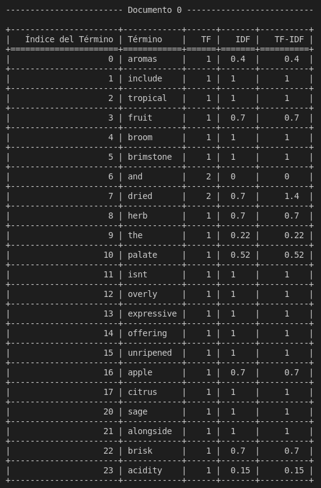
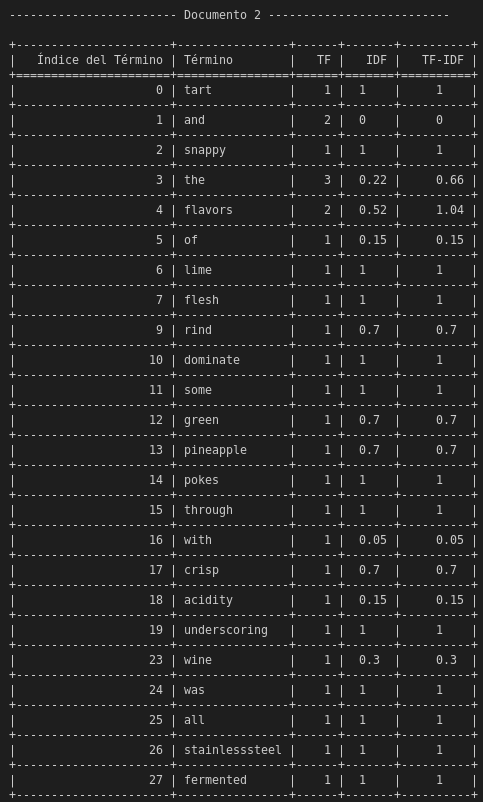
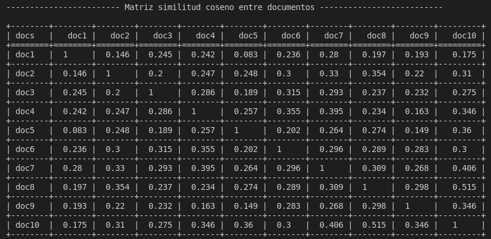

# Sistema de recomendación
## Modelo basado en el Contenido

### Objetivo
El objetivo de esta práctica es implementar un sistema de recomendación siguiendo el modelo basados en el contenido.

### Manual de uso 
Para hacer uso de este programa es necesario ejecutarlo desde una terminal usado ```python3```. Los argumentos a pasar al programa son los siguientes: 
* ```src/main.py``` : Código ejecutable al que le pasaremos los siguientes argumentos
* Nombre del fichero: Este indicará el nombre del fichero de texto a analizar (Para realizar pruebas se dispone de los documentos ubicados en el directorio ```/doc```)
* Número del documento del cual queremos observar la tabla

### Ejemplos de uso

* ```python3 src/main.py documents-01.txt 0 ```  
  
* ```python3 src/main.py documents-01.txt 1 ```  
  
  

### Código
Para la realización de este recomendador se ha creado la clase **RecommendationSystem**, la cual dispone de los siguientes métodos: 
* **```readFile(self, file)```**: leé el fichero pasado como parámetro línea a línea.
* **```cleanDocument(self, linea)```**: procesa el texto leido del fichero eliminando signos de puntuación, convirtiendo todo a minúscula, elimina números, etc. Además convierte cada línea del fichero en un array de arrays donde cada posición representa una palabra.
* **```modelContent(self, i)```**: se le pasa un índice y se encarga de calcular el TF, IDF y TF-IDF de un determinado término haciendo llamadas a otros métodos y retornando los valores obtenidos para un determinado término.
* **```calculateSimCos(self, indexA, indexB)```**: retorna la similitud coseno entre los documentos A y B.
* **```setSimTable(self)```**: Recorre la tabla creada para la similitud entre documentos y hace llamadas al método calculateSimCos para cada par de documentos, rellenando con el valor obtenido dicha tabla.
